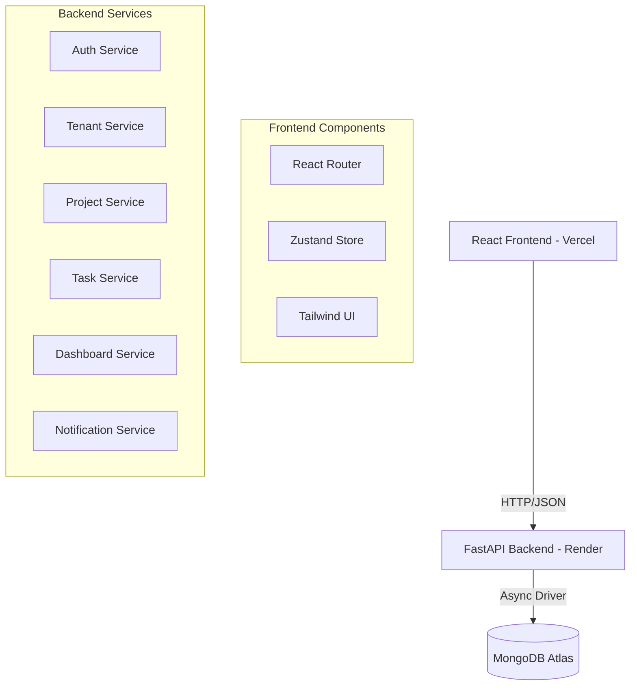

# Team Task Manager - Architecture

## 1. System Architecture

## 2. Data Flow

### Authentication Flow
1. User submits Signup/Login form.
2. Frontend sends request to `/api/auth/signup` or `/api/auth/login`.
3. Backend validates/hashes password and returns a JWT Access Token.
4. Frontend stores token in `localStorage` and `Zustand` store.
5. All subsequent requests include `Authorization: Bearer <token>` header.

### Tenant, Project & Task Flow
1. Authenticated user creates a tenant via `/api/tenants`.
2. Tenant owner/admin creates invite tokens via `/api/tenants/invites`.
3. Invited user accepts via `/api/tenants/invites/accept`.
4. Tenant members create and manage projects in `/api/projects`.
5. Tasks are managed through `/api/projects/{project_id}/tasks` and `/api/tasks/{task_id}` endpoints.
6. Workspace owner can transfer ownership via `/api/tenants/transfer-ownership`.
7. Users can leave workspace via `/api/tenants/leave` (owners must transfer ownership first).
8. Project stats are read from `/api/dashboard/{project_id}/stats`.

### Workspace Lifecycle Rules
- Project assignment is tenant-scoped; users must belong to the same tenant as the project.
- Ownership transfer is owner-only and the target must already be in the same tenant.
- On ownership transfer:
  - Tenant `owner_id` is updated.
  - Previous owner role becomes `admin`.
  - Target user role becomes `owner`.
  - Project `admin_id` entries owned by previous owner are reassigned to the new owner.
- On leave workspace:
  - Owners cannot leave directly.
  - Leaving user is removed from project member lists in that tenant.
  - If leaving user still owns projects and is not tenant owner, those project admin roles are reassigned to current tenant owner.
  - Task assignments to the leaving user in tenant projects are cleared.

## 3. Database Schema & API Models

### Users Collection
- `_id`: ObjectId
- `name`: String
- `email`: String (Unique Index)
- `password`: String (Hashed)
- `tenant_id`: String | null
- `tenant_role`: String | null (`owner`/`admin`/`member`)
- `created_at`: DateTime

### Tenants Collection
- `_id`: ObjectId
- `name`: String
- `owner_id`: String (User id)
- `created_at`: DateTime

### Tenant Invites Collection
- `_id`: ObjectId
- `tenant_id`: String
- `email`: String
- `role`: String
- `token`: String
- `status`: String (`pending`/`accepted`/`expired`)
- `created_by`: String
- `created_at`: DateTime
- `expires_at`: DateTime
- `accepted_at`: DateTime (optional)
- `accepted_by`: String (optional)

### Projects Collection
- `_id`: ObjectId
- `name`: String
- `description`: String
- `tenant_id`: String
- `admin_id`: ObjectId (Ref: Users)
- `members`: Array<ObjectId> (Ref: Users)
- `created_at`: DateTime

**API Response**: Includes `members` populated with `id`, `email`, and `name`.

### Tasks Collection
- `_id`: ObjectId
- `project_id`: ObjectId (Ref: Projects)
- `title`: String
- `description`: String
- `priority`: String (Low/Medium/High)
- `status`: String (To Do/In Progress/In Testing/Done)
- `assigned_to`: ObjectId (Ref: Users)
- `created_by`: ObjectId (Ref: Users)
- `due_date`: DateTime
- `created_at`: DateTime
- `updated_at`: DateTime

**API Response**: Includes `assigned_to_email` and `assigned_to_name`.

## 4. Security Implementation

- **Password Hashing**: BCrypt via `passlib`.
- **Authentication**: JWT (JSON Web Tokens) via `python-jose`.
- **Authorization**: Middleware checks JWT and verifies user identity for every protected route.
- **RBAC**: Tenant role and project-admin checks protect tenant/project/task mutations.

## 5. Deployment

- **Frontend**: Vercel (Auto-deploy from main branch).
- **Backend**: Render (Poetry-based build).
- **Database**: MongoDB Atlas (Cloud Cluster).
