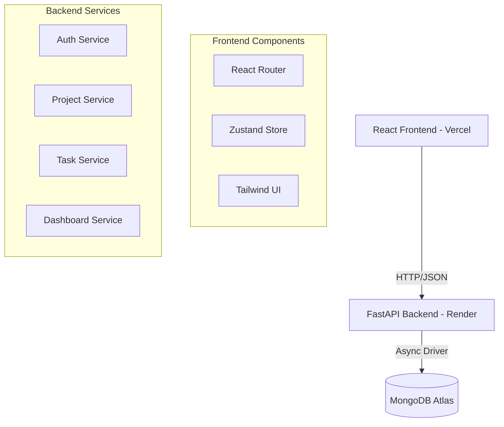

# Team Task Manager - Architecture

## 1. System Architecture

## 2. Data Flow

### Authentication Flow
1. User submits Signup/Login form.
2. Frontend sends request to `/api/auth/signup` or `/api/auth/login`.
3. Backend validates/hashes password and returns a JWT Access Token.
4. Frontend stores token in `localStorage` and `Zustand` store.
5. All subsequent requests include `Authorization: Bearer <token>` header.

### Project & Task Flow
1. Admin creates a project (becomes owner).
2. Admin adds members via email.
3. Admin creates tasks and assigns them to members.
4. Members view projects they belong to and update status of assigned tasks.

## 3. Database Schema

### Users Collection
- `_id`: ObjectId
- `name`: String
- `email`: String (Unique Index)
- `password`: String (Hashed)
- `created_at`: DateTime

### Projects Collection
- `_id`: ObjectId
- `name`: String
- `description`: String
- `admin_id`: ObjectId (Ref: Users)
- `members`: Array<ObjectId> (Ref: Users)
- `created_at`: DateTime

### Tasks Collection
- `_id`: ObjectId
- `project_id`: ObjectId (Ref: Projects)
- `title`: String
- `description`: String
- `priority`: String (Low/Medium/High)
- `status`: String (To Do/In Progress/Done)
- `assigned_to`: ObjectId (Ref: Users)
- `created_by`: ObjectId (Ref: Users)
- `due_date`: DateTime
- `created_at`: DateTime
- `updated_at`: DateTime

## 4. Security Implementation

- **Password Hashing**: BCrypt via `passlib`.
- **Authentication**: JWT (JSON Web Tokens) via `python-jose`.
- **Authorization**: Middleware checks JWT and verifies user identity for every protected route.
- **RBAC**: Project services check if the `current_user` is the `admin_id` before allowing destructive actions (Delete Project, Create/Delete Task).

## 5. Deployment

- **Frontend**: Vercel (Auto-deploy from main branch).
- **Backend**: Render (Poetry-based build).
- **Database**: MongoDB Atlas (Cloud Cluster).
